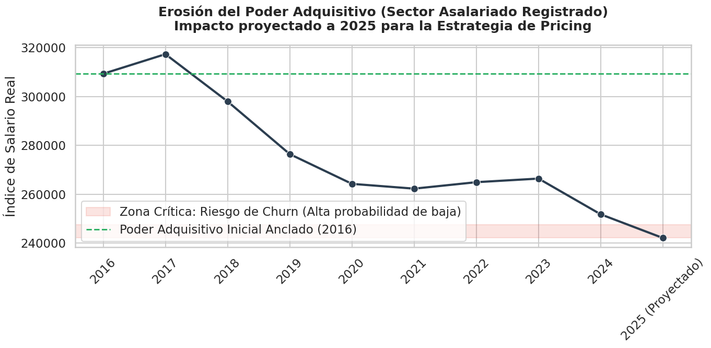

# Dinámica de la Erosión del Salario Real y su Impacto en la Demanda: Un Enfoque Empírico para la Optimización de Estrategias de *Pricing*

**Camila Behar** — camila.behar.l@gmail.com
*Abril 2026*

## 1. Introducción

En contextos macroeconómicos caracterizados por regímenes de alta inflación, la fijación de precios corporativos (*pricing*) suele anclarse en heurísticas subóptimas, siendo la indexación directa al Índice de Precios al Consumidor (IPC) la práctica más extendida. Si bien este enfoque protege el margen nominal unitario de la firma frente al incremento de los costos (inflación de oferta), incurre en una falacia de composición al ignorar la restricción presupuestaria del lado de la demanda. El presente documento expone un análisis teórico-empírico fundamentado en los microdatos del INDEC, con el objetivo de modelar la erosión del poder adquisitivo demográfico y dictaminar una estrategia de precios que minimice la elasticidad precio-demanda y mitigue el riesgo de atrición (*churn*).

## 2. Marco teórico: ilusión monetaria y restricción presupuestaria

Desde la teoría microeconómica clásica, la demanda de un individuo por un servicio X está sujeta a su restricción presupuestaria, definida por \(P_x X + P_y Y = W\), donde \(P\) representa los precios y \(W\) el ingreso nominal.

En períodos inflacionarios, el nivel general de precios (\(P\)) experimenta variaciones positivas continuas. Para que el consumidor mantenga su canasta de consumo inalterada, su ingreso nominal (\(W\)) debe crecer a la misma tasa que la inflación. Matemáticamente, el salario real (\(w\)), que representa el verdadero poder adquisitivo, se define como:

\[ w = \frac{W}{IPC} \times 100 \]

El problema subyacente que revelan los datos es una asimetría en la actualización temporal: los precios de los bienes y servicios se ajustan con mayor frecuencia y magnitud que los salarios. Esto genera un efecto de "ilusión monetaria": aunque el consumidor percibe un aumento en su salario nominal (\(W\)), su salario real (\(w\)) está en declive. Ante esta contracción endógena de la restricción presupuestaria, la teoría del consumidor predice un efecto ingreso negativo. El individuo se ve forzado a reoptimizar su utilidad, recortando el consumo de bienes elásticos (servicios no esenciales, esparcimiento, membresías premium) para sostener el consumo de bienes inelásticos (alimentos básicos, vivienda).

## 3. Metodología empírica y tratamiento de datos

Para cuantificar este fenómeno y trasladarlo a la toma de decisiones empresariales, se prescindió de los promedios macroeconómicos agregados y se recurrió a un enfoque de datos microfundamentados, utilizando dos series históricas oficiales del Instituto Nacional de Estadística y Censos (INDEC):

1. **Cuenta de Generación del Ingreso (CGI):** se extrajeron las series de Remuneración al Trabajo Asalariado (RTA) y Puestos de Trabajo correspondientes al sector registrado.
2. **Índice de Precios al Consumidor (IPC):** se utilizó la serie histórica nacional para la deflactación.

**Ingeniería de características (*feature engineering*):** se construyó el indicador de Salario Nominal Promedio dividiendo la masa salarial total (RTA) por el volumen de puestos de trabajo. Posteriormente, se aplicó un deflactor base 2016=100 utilizando el IPC anualizado. Este proceso metodológico aísla la inflación general y expone la evolución estricta del poder de compra real de los asalariados formales. Finalmente, se aplicó un modelo de *nowcasting* para extrapolar el comportamiento del primer semestre de 2025, asumiendo una dinámica donde la inflación acumulada supera la actualización media de las negociaciones paritarias.

## 4. Discusión de resultados académicos

El análisis de la serie resultante demuestra de forma unívoca un quiebre estructural en la capacidad de consumo del estrato asalariado registrado.

1. **Desacople nominal-real:** la evidencia empírica rechaza la hipótesis de neutralidad del dinero en el corto y mediano plazo. Las paritarias no han logrado neutralizar el shock inflacionario, derivando en una pendiente negativa sostenida en el índice del salario real.
2. **Perforación del umbral de ruptura:** al proyectar los datos hacia 2025, se observa que el poder adquisitivo perfora el 80% de su valor base (2016). En la literatura econométrica, cruzar este umbral implica que servicios previamente clasificados como "bienes normales" (cuya demanda es proporcional al ingreso) muten en el comportamiento del consumidor a "bienes de lujo" o prescindibles.
3. **Aceleración de la elasticidad:** en este nuevo equilibrio macroeconómico, la sensibilidad al precio se exacerba. Un aumento nominal en la tarifa de un servicio, incluso si solo empata la inflación pasada, es percibido por el consumidor como un encarecimiento en términos reales, desencadenando una probabilidad crítica de abandono del servicio (*churn risk*).

*Elaboración propia con datos del INDEC (CGI e IPC).*

## 5. Implicancias corporativas y recomendación estratégica

**Conclusión ejecutiva:** el análisis demuestra que utilizar el IPC general como único vector para la actualización tarifaria constituye un error estratégico grave. Si la empresa ajusta sus precios en un 100% copiando la inflación, pero el salario nominal de sus clientes aumentó solo un 70%, la tarifa de la empresa se ha encarecido en términos reales para ese cliente, forzándolo a cancelar el servicio no por falta de lealtad, sino por insolvencia matemática en su presupuesto familiar.

**Recomendaciones para la mesa directiva:**

1. **Abandono del *pricing* indexado por *pricing* por capacidad de pago (demográfico):** los ajustes de precios no deben basarse en la inflación general (cuánto aumentaron los costos macro), sino en el Índice de Salario Real del segmento específico de clientes al que apunta la empresa. La rentabilidad debe defenderse optimizando costos internos, no asfixiando una demanda ya contraída.
2. **Arquitectura de precios defensiva (*down-selling* sistemático):** se recomienda con carácter de urgencia el diseño e implementación de líneas de servicio o productos de "segunda marca" (planes básicos, formatos reducidos o *lite*). Ante la caída del ingreso real, el consumidor ejercerá un consumo defensivo (*down-trading*). Contar con un producto de menor ticket asegurará que el cliente reduzca su gasto permaneciendo en el ecosistema de la empresa, evitando la destrucción total de volumen y cubriendo los costos fijos.
3. **Microsegmentación de campañas de adquisición:** la erosión del salario real es asimétrica. Se recomienda al departamento de Marketing utilizar estos microdatos para redirigir el presupuesto publicitario (CAC — Costo de Adquisición de Clientes) exclusivamente hacia los deciles sociodemográficos y regiones que exhiban una menor brecha de pérdida de poder adquisitivo, maximizando así el retorno sobre la inversión (ROI) en un mercado recesivo.
